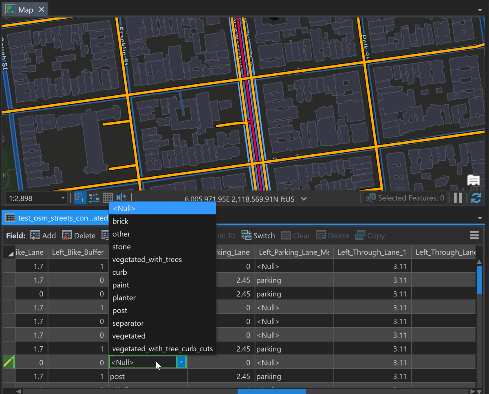

# Shared-ROW Generation ArcGIS Tools 
This repository contains multiple ArcGIS geoprocessing tools that can aid in the creation of shared-row databases (field additions with domains for example), and provide planning product examples that can be derived from its deployment. It also provides some sample applications for how to convert the specification into CityEngine ready street files for import. 

## Core GIS Tool Breakdown

The tools contained within this repository are documented below. 

* 0_Consolidate_Centerline - This tool is intended to help prepare line files for the shared-row-specification by collapsing dual carriageways into single lines. This tool uses a merged feature table to enable statistics on sums, averages, and first statistics on the collapsed lines so that relevant attributes can be preserved and combined appropriately. 

* 1_Additive_Spec_Add_Fields - This script will add shared-row-spec fields that are compliant with the Additive Specification. The additive specification assumes each record is a single line geometry that represents right-of-way from segment to segment (no dual-carriageways).

* 2_Additive_Spec_Add_Domains_To_Geodatabase - This tool will add domains to all categorical fields associated with the additive shared-row specification. If an optional feature class is selected, it will have the appropriate domains assigned to the correspond fields. 

* 3_Generate_Crosswalk_File - This tool will create a crosswalk feature class where an Additive Specification Feature Class will be converted into a flat table where the geometry is repeated, and each "slice" is a row repeated in a table. Slices are allocated based on a simple interpretation of the additive specification with indexes identifying slice order.

* 4_Export_Slice_Geojson - This tool will take an input crosswalk feature class and export it into a geojson file that complies which the slice based shared-row specification. 

### Other Tools

Additional GIS/CityEngine Tools in this toolbox include:

* Additive Spec to CityEngine Export - Export a feature class with Complete Street Rule attributes for CityEngine based on the Additive Spec. 